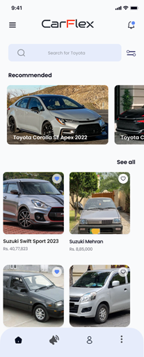

# CarFlex App

CarFlex is a mobile application built using React Native for car enthusiasts. It allows users to explore car videos, manage their profiles, and more.

## Table of Contents

- [Features](#features)
- [Screenshots](#screenshots)
- [Getting Started](#getting-started)
  - [Prerequisites](#prerequisites)
  - [Installation](#installation)
- [Usage](#usage)
- [Project Structure](#project-structure)
- [Technologies Used](#technologies-used)
- [Contributing](#contributing)
- [License](#license)

## Features

- **Welcome Screen:** A welcome screen that allows users to sign in with Facebook, Google, or credentials.
- **Profile Management:** Users can view and edit their profiles, including name, email, phone number, gender, and profile picture.
- **Video Exploration:** Users can explore featured and other car-related videos.
- **Sign-Up:** New users can create an account by providing their name, email, and password.
- **Login:** Existing users can log in using their credentials.

## Screenshots





# Figma

:figma: For Frontend design: https://www.figma.com/file/VJzIKtEFXm8tW8Iq7wAQtd/Car-Flex-Interface?type=design&node-id=0%3A1&mode=design&t=P5b5cN4OyDNUGQiz-1

## Getting Started

> **Note**: Make sure you have completed the [React Native - Environment Setup](https://reactnative.dev/docs/environment-setup) instructions till "Creating a new application" step, before proceeding.

### Prerequisites

- [Node.js](https://nodejs.org/)
- [npm](https://www.npmjs.com/) or [Yarn](https://yarnpkg.com/)

### Installation

1. Clone the repository.

   ```bash
   git clone https://github.com/yourusername/CarFlex.git
   cd CarFlex
   ```

2. Install dependencies.

You will need to start **Metro**, the JavaScript _bundler_ that ships _with_ React Native.

To start Metro, run the following command from the _root_ of your React Native project:

```bash
npm i
```

or

> **Note**: I reccomend using yarn

```bash
yarn
```

3. Run the application.

   ```bash
   yarn
   yarn start

   ```

4. Incase of gradle discreptencies.
   ```bash
   cd andriod
   gradlew clean
   cd ..
   yarn start --reset-cache
   ```

If everything is set up _correctly_, you should see your new app running in your _Android Emulator_ or _iOS Simulator_ shortly provided you have set up your emulator/simulator correctly.

This is one way to run your app — you can also run it directly from within Android Studio and Xcode respectively.

## Congratulations! :tada:

You've successfully run and modified your React Native App. :partying_face:

## Project Structure

- `src`: Contains the source code for the React Native app.
  - `components`: Reusable components used across screens.
  - `screens`: Individual screens of the application.
  - `navigation`: Navigation configuration.
  - `context`: Context providers.

## Technologies Used

- React Native
- Firebase (Authentication, Firestore)
- Fetch API (Rapid API)

## Contributing

Contributions are welcome! Fork the repository and submit a pull request.
